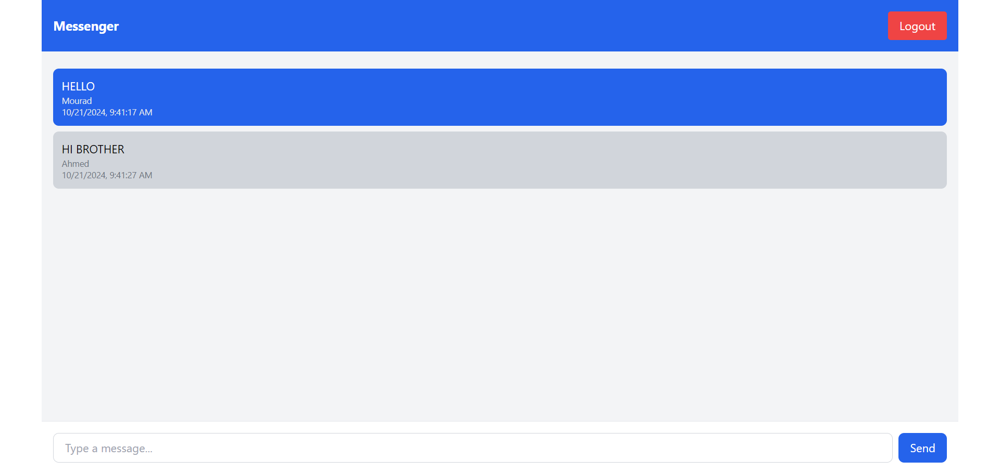

# Chat App - Real-time Messaging Platform



[Chat App - Live Application](https://your-live-chat-app-link.com/)

Chat App is a real-time messaging platform that allows users to send and receive messages instantly. Built with modern technologies, it ensures smooth, real-time communication with a clean and intuitive interface.

## Features

- Real-time messaging powered by Socket.IO.
- View message history with timestamps and sender details.
- Responsive design for seamless usage across devices.
- User identification with personalized usernames.
- Messages stored and retrieved from PostgreSQL database.

## Technologies Used

- React.js
- Tailwind CSS
- Node.js
- Express.js
- Socket.IO
- PostgreSQL

## Installation

### Prerequisites
Ensure you have the following installed:
- **Node.js** (v14 or higher)
- **PostgreSQL**

### Steps

1. **Clone the repository:**
   ```bash
   git clone https://github.com/M0BEAM/chat-app.git
   cd chat-app
2. **Install dependencies:**  
**Server Side:** 
   ```bash
   cd server
   npm install
   npx ts-node --esm server.ts
**Client Side:** 
   ```bash
   cd client
   npm install
   npm run dev

3.Set up PostgreSQL:

Install PostgreSQL if not already installed. You can download it from here.

Open your PostgreSQL client and create a new database. Run the following command in your PostgreSQL shell:

   CREATE DATABASE chat_app_db;
Create the messages table in the database:
CREATE TABLE messages (
  id SERIAL PRIMARY KEY,
  content TEXT NOT NULL,
  sender VARCHAR(255) NOT NULL,
  created_at TIMESTAMPTZ DEFAULT CURRENT_TIMESTAMP
);
In the root of your project, create a .env file and add your PostgreSQL connection string like so:
DATABASE_URL=your-postgresql-connection-string

## License

This project is licensed under the [MIT License].